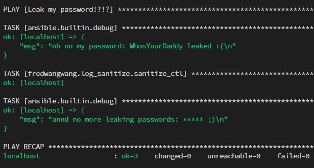

# Ansible Collection - fredwangwang.log_sanitize

adding the ability to sanitize the log before printing to screen.

Gives more insights as of why certain task fails compared with `no_log: true`, yet
not leaking sensitive information in logs.

example:

